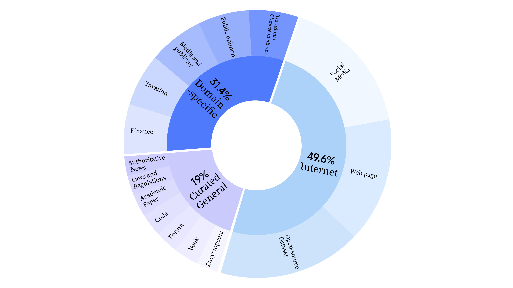
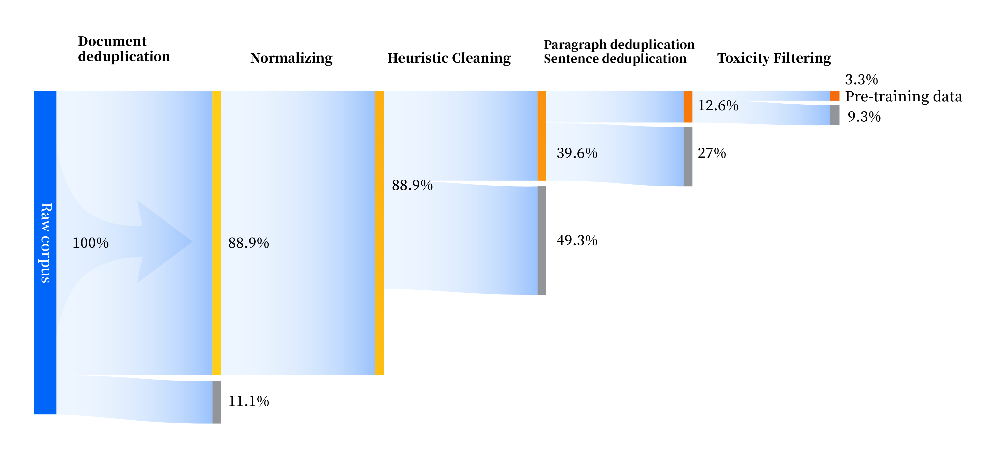
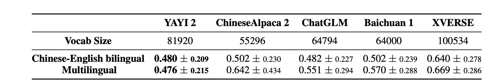
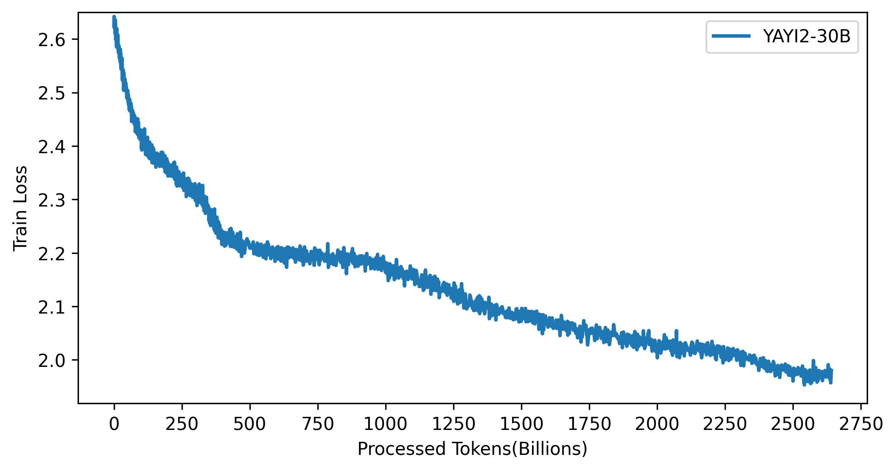

<div align="center">

<br>

[](./LICENSE)
[](./LICENSE_DATA)
[](./LICENSE_MODEL)

[[📖README](./README.md)] 
[[🤗HF Repo](https://huggingface.co/wenge-research)]
[[🔗WEB](https://yayi.wenge.com)]

English | [中文](./README.md)

</div>


## Update
[2023.12.22] We released our technical report🔥🔥🔥[YAYI 2: Multilingual Open-Source Large Language Models](https://arxiv.org/abs/2312.14862).

## Introduction
YAYI 2 is the new generation of open-source large language models launched by Wenge Technology. It has been pretrained for 2.65 trillion tokens of multilingual data with high quality. The base model is aligned with human values through supervised fine-tuning with millions of instructions and reinforcement learning from human feedback (RLHF).

We opensource the pre-trained language model in this release, namely **YAYI2-30B**. By open-sourcing the YAYI 2 model, we aim to contribute to the development of the Chinese pre-trained large language model open-source community. Through open-source, we aspire to collaborate with every partner in building the YAYI large language model ecosystem. 

For more technical details, please read our technical report 🔥[YAYI 2: Multilingual Open-Source Large Language Models](https://arxiv.org/abs/2312.14862).

## Model download

|  Model  | Context Length |🤗 HF Model Name           |  Download Links  |
| :--------- | :---------  | :---------               | :--------- |
|  YAYI2-30B | 4096        | wenge-research/yayi2-30b| [download](https://huggingface.co/wenge-research/yayi2-30b)|
| YAYI2-Chat-30B | 4096    | wenge-research/yayi2-chat-30b| Comming soon... |


## Evaluation

We evaluated our model on standard benchmarks, including C-Eval, MMLU, CMMLU, AGIEval, GAOKAO-Bench, GSM8K, MATH, BBH, HumanEval, and MBPP. Our goal is to assess the model's performance in language comprehension, knowledge comprehension, mathematical reasoning, logical reasoning, and code generation.  YAYI 2 has demonstrated exceptional performance across models with similar size.

<table id="myTable">
  <!-- Table header -->
  <tr>
        <th></th>
        <th colspan="5" style="text-align: center;">Knowledge</th>
        <th colspan="2" style="text-align: center;">Math</th>
        <th colspan="1" style="text-align: center;">Logic reasonning</th>
        <th colspan="2" style="text-align: center;">Code</th>
  </tr>
  <tr>
        <th style="text-align: left;">Model</th>
        <th>C-Eval(val)</th>
        <th>MMLU</th>
        <th>AGIEval</th>
        <th>CMMLU</th>
        <th>GAOKAO-Bench</th>
        <th>GSM8K</th>
        <th>MATH</th>
        <th>BBH</th>
        <th>HumanEval</th>
        <th>MBPP</th>
  </tr>
  <tr>
        <td></td>
        <td style="text-align: center;">5-shot</td>
        <td style="text-align: center;">5-shot</td>
        <td style="text-align: center;">3/0-shot</td>
        <td style="text-align: center;">5-shot</td>
        <td style="text-align: center;">0-shot</td>
        <td style="text-align: center;">8/4-shot</td>
        <td style="text-align: center;">4-shot</td>
        <td style="text-align: center;">3-shot</td>
        <td style="text-align: center;">0-shot</td>
        <td style="text-align: center;">3-shot</td>
        </tr>
        <tr>
        <td><strong>MPT-30B</strong></td>
        <td style="text-align: center;">-</td>
        <td style="text-align: center;">46.9</td>
        <td style="text-align: center;">33.8</td>
        <td style="text-align: center;">-</td>
        <td style="text-align: center;">-</td>
        <td style="text-align: center;">15.2</td>
        <td style="text-align: center;">3.1</td>
        <td style="text-align: center;">38.0</td>
        <td style="text-align: center;">25.0</td>
        <td style="text-align: center;">32.8</td>
  </tr>
  <tr>
        <td><strong>Falcon-40B</strong></td>
        <td style="text-align: center;">-</td>
        <td style="text-align: center;">55.4</td>
        <td style="text-align: center;">37.0</td>
        <td style="text-align: center;">-</td>
        <td style="text-align: center;">-</td>
        <td style="text-align: center;">19.6</td>
        <td style="text-align: center;">5.5</td>
        <td style="text-align: center;">37.1</td>
        <td style="text-align: center;">0.6</td>
        <td style="text-align: center;">29.8</td>
  </tr>
  <tr>
        <td><strong>LLaMA2-34B</strong></td>
        <td style="text-align: center;">-</td>
        <td style="text-align: center;">62.6</td>
        <td style="text-align: center;">43.4</td>
        <td style="text-align: center;">-</td>
        <td style="text-align: center;">-</td>
        <td style="text-align: center;">42.2</td>
        <td style="text-align: center;">6.2</td>
        <td style="text-align: center;">44.1</td>
        <td style="text-align: center;">22.6</td>
        <td style="text-align: center;">33.0</td>
  </tr>
  <tr>
        <td><strong>Baichuan2-13B</strong></td>
        <td style="text-align: center;">59.0</td>
        <td style="text-align: center;">59.5</td>
        <td style="text-align: center;">37.4</td>
        <td style="text-align: center;">61.3</td>
        <td style="text-align: center;">45.6</td>
        <td style="text-align: center;">52.6</td>
        <td style="text-align: center;">10.1</td>
        <td style="text-align: center;">49.0</td>
        <td style="text-align: center;">17.1</td>
        <td style="text-align: center;">30.8</td>
  </tr>
  <tr>
        <td><strong>Qwen-14B</strong></td>
        <td style="text-align: center;">71.7</td>
        <td style="text-align: center;">67.9</td>
        <td style="text-align: center;">51.9</td>
        <td style="text-align: center;">70.2</td>
        <td style="text-align: center;">62.5</td>
        <td style="text-align: center;">61.6</td>
        <td style="text-align: center;">25.2</td>
        <td style="text-align: center;">53.7</td>
        <td style="text-align: center;">32.3</td>
        <td style="text-align: center;">39.8</td>
  </tr>
  <tr>
        <td><strong>InternLM-20B</strong></td>
        <td style="text-align: center;">58.8</td>
        <td style="text-align: center;">62.1</td>
        <td style="text-align: center;">44.6</td>
        <td style="text-align: center;">59.0</td>
        <td style="text-align: center;">45.5</td>
        <td style="text-align: center;">52.6</td>
        <td style="text-align: center;">7.9</td>
        <td style="text-align: center;">52.5</td>
        <td style="text-align: center;">25.6</td>
        <td style="text-align: center;">35.6</td>
  </tr>
  <tr>
        <td><strong>Aquila2-34B</strong></td>
        <td style="text-align: center;">98.5</td>
        <td style="text-align: center;">76.0</td>
        <td style="text-align: center;">43.8</td>
        <td style="text-align: center;">78.5</td>
        <td style="text-align: center;">37.8</td>
        <td style="text-align: center;">50.0</td>
        <td style="text-align: center;">17.8</td>
        <td style="text-align: center;">42.5</td>
        <td style="text-align: center;">0.0</td>
        <td style="text-align: center;">41.0</td>
  </tr>
  <tr>
        <td><strong>Yi-34B</strong></td>
        <td style="text-align: center;">81.8</td>
        <td style="text-align: center;">76.3</td>
        <td style="text-align: center;">56.5</td>
        <td style="text-align: center;">82.6</td>
        <td style="text-align: center;">68.3</td>
        <td style="text-align: center;">67.6</td>
        <td style="text-align: center;">15.9</td>
        <td style="text-align: center;">66.4</td>
        <td style="text-align: center;">26.2</td>
        <td style="text-align: center;">38.2</td>
  </tr>
  <tr>
        <td><strong>YAYI2-30B</strong></td>
        <td style="text-align: center;">80.9</td>
        <td style="text-align: center;">80.5</td>
        <td style="text-align: center;"><b>62.0</b></td>
        <td style="text-align: center;"><b>84.0</b></td>
        <td style="text-align: center;">64.4</td>
        <td style="text-align: center;"><b>71.2</b></td>
        <td style="text-align: center;">14.8</td>
        <td style="text-align: center;">54.5</td>
        <td style="text-align: center;"><b>53.1</b></td>
        <td style="text-align: center;"><b>45.8</b></td>
  </tr>
</table>


We evaluate our model using the source code from the [OpenCompass Github repository](https://github.com/open-compass/opencompass). If available, we report results for comparative models assessed by OpenCompass with the evaluation reference date set to Dec. 15th, 2013. For MPT, Falcon, and Llama, which have not been evaluated by OpenCompass, we use the results reported in the [LLaMA 2](https://arxiv.org/abs/2307.09288) paper.


## Quick Start

You can follow the steps below to run YAYI 2 model with transformers.

1. Clone this repository to the local environment:

```bash
git clone https://github.com/wenge-research/YAYI2.git
cd YAYI2
```

2. Create a conda virtual environment:

```bash
conda create --name yayi_inference_env python=3.10
conda activate yayi_inference_env
```
Please note that this project requires Python 3.8 or higher. 

3. Install dependencies:
    
```bash
pip install -r requirements.txt
```

### pre-trained model inference

```python
>>> from transformers import AutoModelForCausalLM, AutoTokenizer
>>> tokenizer = AutoTokenizer.from_pretrained("wenge-research/yayi2-30b", trust_remote_code=True)
>>> model = AutoModelForCausalLM.from_pretrained("wenge-research/yayi2-30b", device_map="auto", trust_remote_code=True)
>>> inputs = tokenizer('The winter in Beijing is', return_tensors='pt')
>>> inputs = inputs.to('cuda')
>>> pred = model.generate(
        **inputs, 
        max_new_tokens=256, 
        eos_token_id=tokenizer.eos_token_id, 
        do_sample=True,
        repetition_penalty=1.2,
        temperature=0.4, 
        top_k=100, 
        top_p=0.8
        )
>>> print(tokenizer.decode(pred.cpu()[0], skip_special_tokens=True))
```

The first-time downloading and loading the model could take some time.


### Model fine-tuning

This project utilizes the `deepspeed` framework for model training. After setting up the environment, you can execute the corresponding scripts to train the model. It supports full-parameter fine-tuning and  LoRA fine-tuning.

### Set up environment

1. Create a conda virtual environment:
   
```bash
conda create --name yayi_train_env python=3.10
conda activate yayi_train_env
```

2. Install dependencies:

```bash
pip install -r requirements.txt
```

3. Install accelerate:

```bash
pip install --upgrade accelerate
```

4. Install flashattention

```bash
pip install flash-attn==2.0.3 --no-build-isolation
pip install triton==2.0.0.dev20221202  --no-deps 
```


### Full-parameter fine-tuning

* **Data format**: Refer to `data/yayi_train_example.json`, which is a standard JSON file. Each data entry consists of `"system"` and `"conversations"`. `"system"` contains global role-setting information and can be an empty string. `"conversations"` contains multi-turn dialogue content conducted alternately between human and YAYI roles.
* **Instructions**: Running the following command will initiate full-parameter fine-tuning of the YAYI model. It is recommended to use hardware configurations with 16 or more A100 GPUs (80GB each).

```bash
deepspeed --hostfile config/hostfile \
    --module training.trainer_yayi2 \
    --report_to "tensorboard" \
    --data_path "./data/yayi_train_example.json" \
    --model_name_or_path "your_model_path" \
    --output_dir "./output" \
    --model_max_length 2048 \
    --num_train_epochs 1 \
    --per_device_train_batch_size 1 \
    --gradient_accumulation_steps 1 \
    --evaluation_strategy "no" \
    --save_strategy "steps" \
    --save_steps 500 \
    --save_total_limit 10 \
    --learning_rate 5e-6 \
    --warmup_steps 2000 \
    --lr_scheduler_type cosine \
    --logging_steps 1 \
    --gradient_checkpointing True \
    --deepspeed "./config/deepspeed.json" \
    --bf16 True 
```

Start the training using shell scripts:
```bash
bash scripts/start.sh
```


### LoRA fine-tuning
* **Data format**: Same as above, refer to `data/yayi_train_example.json`.
* Running the following command will initiate LoRA fine-tuning of the YAYI model.
```bash
bash scripts/start_lora.sh
```


## Pre-Training Data
* During the pre-training phase, we not only utilized internet data to train the model's language abilities but also incorporated curated general data and domain-specific information to enhance the model's expertise. Details of the data distribution are as follows:




* We establish a comprehensive data processing pipeline to enhance data quality in all aspects. This pipeline comprises four modules: normalizing, heuristic cleaning, multi-level deduplication, and toxicity filtering. 240 terabytes of raw data are collected for pre-training, and only 10.6 terabytes of high-quality data remain after preprocessing. Details of the data processing pipeline are as follows:



## Tokenizer
* YAYI 2 tokenizer adopts Byte-Pair Encoding (BPE) algorithm from the Sentence-Piece library. The tokenizer is trained high-quality multilingual corpus of on a 500GB, which covers over ten commonly used languages such as Chinese, English, French and Russian. 
* We decomposed the numbers digit by digit for mathematical reasoning. Simultaneously, we manually added numerous HTML identifiers and common punctuation marks to the vocabulary to enhance tokenization accuracy. Additionally, we reserved 200 slots for potential future applications, such as incorporating identifiers during fine-tuning stages for specific directives.
* In our comprehensive evaluation of YAYI 2 tokenizer’s multilingual performance, we sample data with a uniform length of 10,000 tokens, covering Chinese, English, and various minor languages. The compression ratio is presented in the following table.



* A lower compression ratio indicates superior training and inference efficiency.


## Loss 
The following figure shows the final pre-training loss of YAYI2-30B. 



## Related agreements


### Open Source License
The code in this project is open-sourced under the [Apache-2.0](LICENSE) license. The use of YaYi series model weights and data must adhere to the [YAYI 2 Community License](COMMUNITY_LICENSE). If you intend to use the YAYI 2 series models or their derivatives for commercial purposes, please complete the [YAYI 2 Model Commercial Registration Information](REGISTRATION_INFORMATION_EN) and send it to yayi@wenge.com. After receiving the email, we will conduct an audit within 3 working days. Once the audit is passed, you will receive a commercial license. Please strictly comply with the relevant content of the [YAYI 2 Model Commercial License Agreement](COMMERCIAL_LICENSE) during the use process. Thank you for your cooperation!


### Citation
If you are using the resource for your work, please cite our paper.
```
@article{YAYI 2,
  author    = {Yin Luo, Qingchao Kong, Nan Xu, et.al.},
  title     = {YAYI 2: Multilingual Open Source Large Language Models},
  journal   = {arXiv preprint arXiv:2312.14862},
  url       = {https://arxiv.org/abs/2312.14862},
  year      = {2023}
}
```

## Star History
[](https://star-history.com/#wenge-research/YAYI2&Date)
